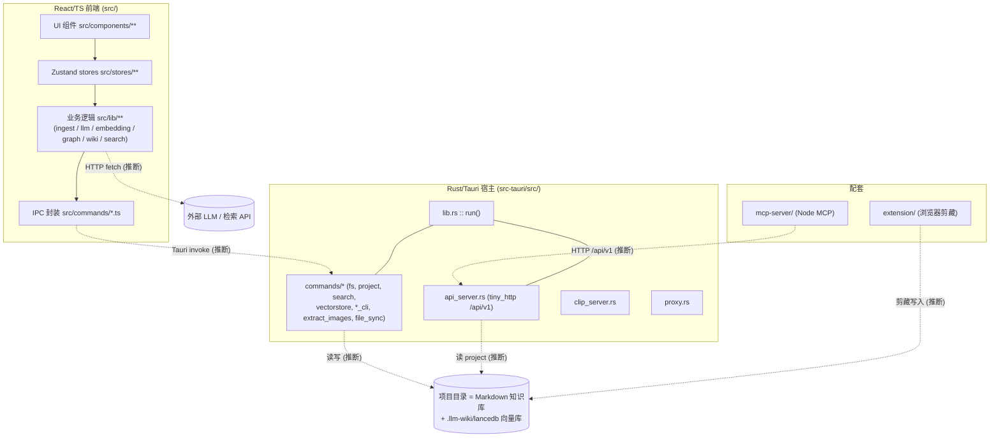

# 00 · 架构总览（D1）

> **Confidence 图例**（逐章必读）：
> `已确认` = 仅字面存在性、已 grep 核验，**非语义/运行验证**；
> `推断` = 未经运行验证的判断；`未解之谜` = 需运行或未读到。

## 摘要
LLM Wiki 是一个桌面应用，由三大块组成：**Rust/Tauri 宿主进程**（窗口、托盘、本地 HTTP API、向量库、文件系统命令、子进程 CLI 桥接）、**React/TypeScript 前端**（UI + 全部业务逻辑：ingest、LLM 调用、图谱、检索、lint）、以及**配套 MCP server 与浏览器扩展**。前端通过 Tauri IPC（`invoke`）调用 Rust 命令；Rust 侧还自带一个 `tiny_http` 本地 API server 供 MCP/外部集成访问当前 project。后端为 `none`（纯模式），故所有跨层调用、运行期数据流均标「推断」。

## 关键文件
| 文件 | 角色 | confidence |
|---|---|---|
| `src-tauri/src/lib.rs` :: `pub fn run` | Tauri 应用入口：注册插件、setup、`invoke_handler` 命令清单、窗口事件 | 已确认 |
| `src-tauri/src/main.rs` | 二进制入口（调用 lib 的 run） | 推断 |
| `src-tauri/src/api_server.rs` :: `API_PREFIX` | 本地 HTTP API server（`tiny_http`），端口/前缀常量 | 已确认 |
| `src/main.tsx` / `src/App.tsx` | React 根挂载 + 顶层应用状态编排 | 推断 |
| `src-tauri/src/commands/` (mod.rs) | Rust 命令模块聚合：fs/project/search/vectorstore/claude_cli/codex_cli/extract_images/file_sync | 已确认 |
| `src/lib/` (~190 文件) | 前端业务逻辑库：ingest、llm、embedding、graph、wiki、search… | 推断 |
| `src/stores/` | Zustand 全局状态 | 推断 |

## 关键结论
- **应用分三层：Rust 宿主 / React 前端 / 配套（MCP server + 扩展）** `confidence: 推断` — 引用：`src-tauri/src/lib.rs`、`src/App.tsx`、`mcp-server/src/index.ts`、`extension/manifest.json`（分层是主 agent 对目录边界的判断，关系性 → 推断）
- **Tauri 入口在 `lib.rs` 的 `run()`，集中注册插件与命令** `confidence: 已确认（仅字面存在性）` — 引用：`src-tauri/src/lib.rs :: pub fn run`（脚本回查命中；其「在启动时被调用/注册顺序」属运行期 → 推断）
- **Rust 侧暴露一组 `#[tauri::command]` 供前端 `invoke`** `confidence: 推断` — 引用：`src-tauri/src/lib.rs :: invoke_handler`、`src/commands/fs.ts`（IPC 调用边为行为性 → 推断）
- **Rust 内置本地 HTTP API（`tiny_http`，前缀 `/api/v1`）独立于 IPC** `confidence: 已确认（仅字面存在性）` — 引用：`src-tauri/src/api_server.rs :: API_PREFIX`（端口 `19828` 等常量字面存在；其实际监听/路由分发属运行期 → 推断）
- **前端承载绝大部分业务逻辑（约 190 个 `src/lib` 文件）** `confidence: 推断` — 引用：`src/lib/`（文件数为目录观察；职责归纳为关系性 → 推断）

## 架构图（Mermaid · 全局，subsystem 间关系）

> ⚠️ 纯模式下连线为**最佳努力近似（推断）**，非确定运行关系。

## 本章未解之谜
- IPC 命令在运行期的真实调用频率/触发路径（需运行）。
- `api_server` 与 MCP server 的实际握手与鉴权（需运行 + 见 [[95-risks]]）。
- 前端各 subsystem 的真实加载顺序与依赖时序（需运行）。
