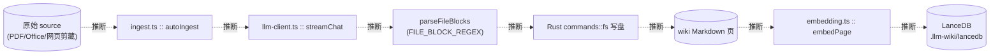

# 20 · 数据流（D3）

> **Confidence 图例**：`已确认` = 仅字面存在性、已 grep 核验，非语义/运行验证；`推断` = 未运行验证的判断；`未解之谜` = 需运行或未读到。
> 本章绝大多数为**关系/顺序/流向**结论 → **最高「推断」**（纯模式，无解析器后端）。

## 摘要
两条主数据流（均为推断）：
1. **摄取流（Ingest）**：原始 source → `ingest.ts :: autoIngest` 读取/清洗/分块 → LLM 生成（`llm-client :: streamChat`）→ 解析 `---FILE---` 块 → 写入 wiki Markdown（经 `commands::fs`）→ 更新 index/log → 嵌入向量（`embedding.ts` → `vectorstore.rs` LanceDB）。
2. **查询/对话流（Query）**：用户提问 → 检索（全文 `search.rs` + 向量 `searchByEmbedding` + 可选 `webSearch`）→ 组装上下文（`context-budget.ts`）→ `streamChat` 流式回答 → 引用回填 chat-store，可存回 wiki（`chat-save-to-wiki.ts`）。

## 数据流图（Mermaid · 摄取流，推断）

## 关键结论
- **摄取产物为 Obsidian 兼容 Markdown + 向量索引** `confidence: 推断` — 引用：`src/lib/ingest.ts :: executeIngestWrites`、`src/lib/embedding.ts :: embedPage`（流向为行为性 → 推断）
- **查询走"多路检索 → 上下文预算 → 流式生成"** `confidence: 推断` — 引用：`src/lib/search.ts`、`src/lib/context-budget.ts`、`src/lib/llm-client.ts :: streamChat`（顺序需读多处控制流 → 推断）
- **好的回答可回填为新 wiki 页** `confidence: 推断` — 引用：`src/lib/chat-save-to-wiki.ts`（行为性 → 推断；与 `llm-wiki.md` 设计意图一致）

## 本章未解之谜
- 各阶段实际数据格式与中间态（需运行/精读 `ingest.ts` 正文）。
- 检索三路的合并、去重与排序的真实运行结果（需运行）。
